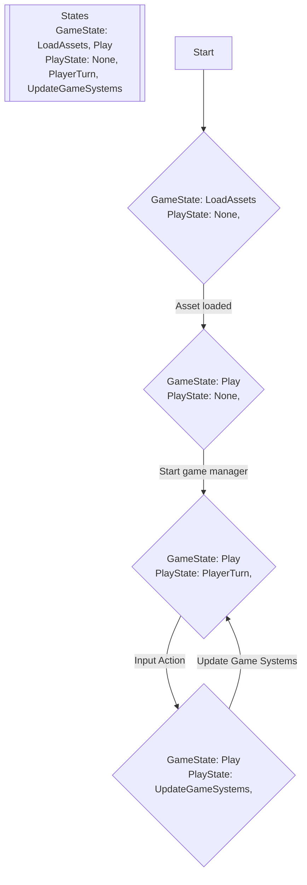

# nik-first-roguelike

## Event loop

```mermaid
graph TD
    Nop[["States
      GameState: LoadAssets, Play
      PlayState: None, PlayerTurn, UpdateGameSystems
    "]]

    A[Start] --> B{"
      GameState: LoadAssets
      PlayState: None,
      "}
    B --Asset loaded--> C{"
      GameState: Play
      PlayState: None,
      "}
    C --Start game manager--> D{"
      GameState: Play
      PlayState: PlayerTurn,
      "}
    D --Input Action--> E{"
      GameState: Play
      PlayState: UpdateGameSystems,
    "}
    E --Update Game Systems--> D
```
